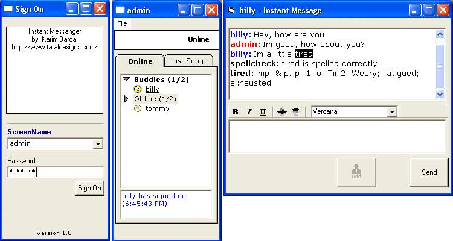



## VB6 Instant Messenger

### Description

An instant messenger similar to the style of AOL Instant Messenger.

After going through this tutorial: http://www.vb-world.net/internet/winsock/index.html and coming across an ICQ Type instant messenger coded by Evan Sims (http://www.planetsourcecode.com/xq/ASP/txtCodeId.6520/lngWId.1/qx/vb/scripts/ShowCode.htm), I decided to build an AOL type instant messenger program in VB6.

[INFO]

Currently, there isn't a way for users to register a username/password, so If you want to test it out, you have to create a user in IMDB.mdb under the USERS table.

After adding some users, you can test out the program by launching the server.exe and running 2 of the client.exe's. Enter the username/password, add the buddy to your buddy list, and start chatting :)

If you want users over the internet to be able to use this program, change the RemoteHost IP address in Client.vbp to the IP where the server is running.

[ERRORS]

Currently, There are 2 known errors.

1. When adding a buddy to buddy list and you receive a message.

2. When deleting a buddy from buddy list and you receive a message.

This is due to the fact that the popupbox is modal, I just haven't gotten around to fixing it.

Also, Make sure you close your clients before you close your server, otherwise, you'll have to go in Manually and delete all entries from the ONLINE table.

[DEFINITIONS and SPELLCHECK]

I've always wanted a Instant Messenger that incorporated that! So I did it myself :)

But, for it to work for you, you'll have to get the Definitions database, which is a hefty 37MB in size!

Post a message here if you would like the database, I'll see what i can do. You should receive an error if you try to Define or Spellcheck a word without the database, duh! :P

That should sum it up, I would appreciate your comments and suggestions, and post any questions you have as well.

Thanks
 
### More Info
 

             |
---                |---
**Submitted On**   |2002-01-17 11:45:34
**By**             |[Karim Bardai](https://github.com/Planet-Source-Code/PSCIndex/blob/master/ByAuthor/karim-bardai.md)
**Level**          |Intermediate
**User Rating**    |4.8 (58 globes from 12 users)
**Compatibility**  |VB 6\.0
**Category**       |[Complete Applications](https://github.com/Planet-Source-Code/PSCIndex/blob/master/ByCategory/complete-applications__1-27.md)
**World**          |[Visual Basic](https://github.com/Planet-Source-Code/PSCIndex/blob/master/ByWorld/visual-basic.md)
**Archive File**   |[VB6\_Instan493481172002\.zip](https://github.com/Planet-Source-Code/karim-bardai-vb6-instant-messenger__1-30836/archive/master.zip)

